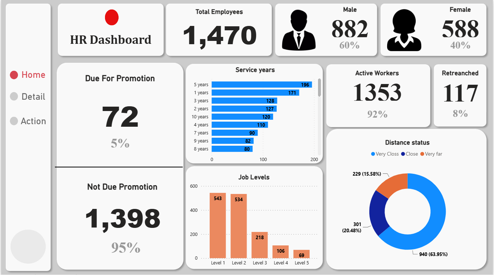
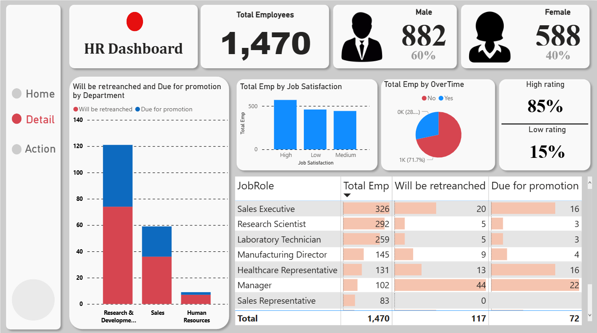
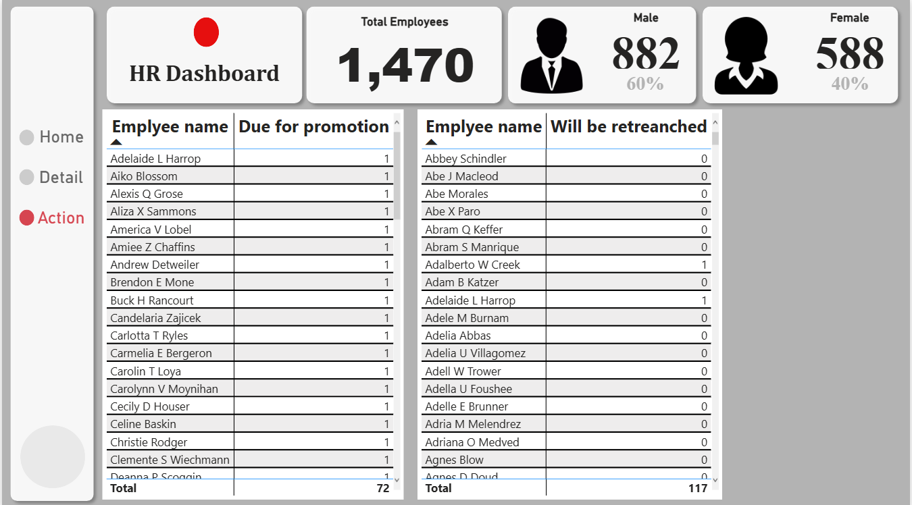

# 📊 HR Analytics Dashboard | Power BI

An interactive **HR Dashboard** built with **Power BI** to analyze workforce data and support HR decision-making.  

---

## 📌 Project Overview
This dashboard provides insights into **employee demographics, job satisfaction, promotions, and retention trends**.  
It enables HR managers to make **data-driven decisions** about workforce management.  

---

## 🚀 Key Features
- 👥 **Employee Demographics**  
  - Total employees: 1,470  
  - Gender distribution (60% Male, 40% Female)  

- 🎯 **Promotion Analysis**  
  - Due for promotion: 72 employees  
  - Not due: 1,398 employees  

- ⏳ **Service Years Distribution**  
  - Employee counts across 1–10 years of service  

- 🏢 **Job Levels**  
  - Breakdown from Level 1 to Level 5  

- 🔄 **Employment Status**  
  - Active: 1,353  
  - Retrenched: 117  

- 🌍 **Distance Status**  
  - Very Close, Close, Very Far  

- 😊 **Job Satisfaction**  
  - High, Medium, Low levels  

- ⏰ **Overtime Analysis**  
  - 72% No Overtime  
  - 28% Overtime  

- 📋 **Detailed Employee Insights**  
  - Names of employees due for promotion  
  - Names of employees marked for retrenchment  

---

## 📸 Dashboard Previews

### 🔹 Home

### 🔹 Details

### 🔹 Action

---

## 📂 Files in this Repository
- `HR_Dashboard.pbix` → Main Power BI dashboard file.  
- `Data/` → (Optional) dataset used to build the dashboard.  
- `screenshots/` → Preview images of the dashboard.  
- `README.md` → Project documentation.  

---

## 🛠️ Tools & Technologies
- **Power BI Desktop**  
- **Data Modeling with DAX**  
- **Excel / CSV** (as data sources)  

---

---

## 📫 Let’s Connect
- 💼 [LinkedIn](https://www.linkedin.com/in/ahmedghoonim)  
- 📘 [Facebook](https://www.facebook.com/share/19JWnRjSrQ/)  
- ✉️ Email: [ghnewa1911@gmail.com]  
